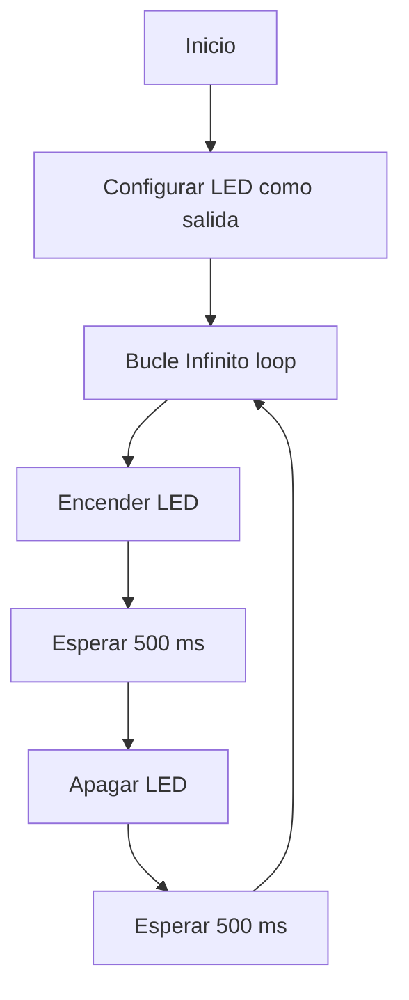
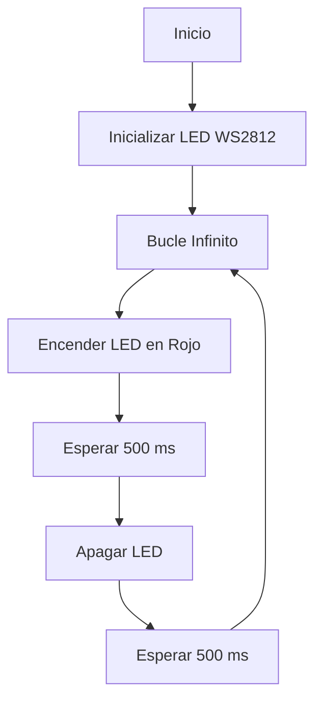
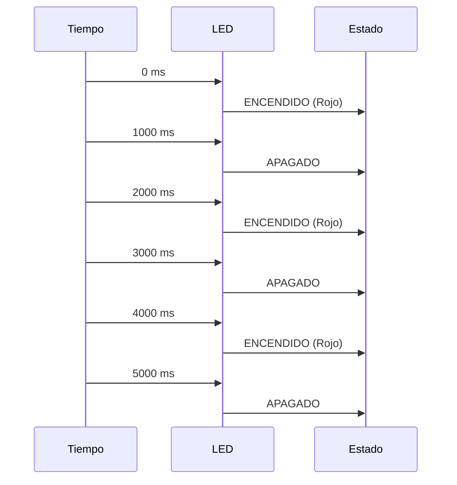

# Pràctica 1
## Introducció
En aquesta pràctica a través d’eines de programació com és el Visual Studio Code i el programari de Platformio tindrem com a objectiu controlar un led connectat a la placa esp32-s3 de espressif, utilitzant com a eina de depuració el serial port.


# Preparació

Primerament, abans de fer res en el codi principal per a definir què farà el nostre programa, caldrà especificar les característiques de la nostra placa de desenvolupament en la que treballarem en el arxiu .ini . Aquesta definició de característiques ja la fa automàticament el programa al crear el projecte i al haver seleccionat la placa en qüestió, però cal repassar que estigui tot en ordre per poder treballar centrats en el codi i poder-nos oblidar de si poden haver problemes a l’hora d’executar el codi que puguin tenir origen a l’arxiu .ini.
A continuació es mostra el nostre archiu .ini:
```
[env:esp32-s3-devkitm-1]
platform = espressif32
board = esp32-s3-devkitm-1
framework = arduino
```
Caldrà afegir la linea següent que estableix la velocitat de comunicació entre el esp32-s3 i el ordinador al utilitzar el monitor sèrie.
```
monitor_speed= 115200
```

## Creació del main()
#### Primera Part
Primerament buscarem iniciar el pin led com a sortida i a través d'un bucle infinit encendre el led, esperar 500ms, apagar el led i esperar 500ms. Tal i com es mostra en el següent codi:
 ```
#include  <Arduino.h>
#define  LED_BUILTIN  2
#define  DELAY  500
void  setup() {
pinMode(LED_BUILTIN, OUTPUT);
}
void  loop() {
digitalWrite(LED_BUILTIN, HIGH);
delay(DELAY);
digitalWrite(LED_BUILTIN, LOW);
delay(DELAY);
}
```
En el codi anterior el void setup() estableix el pin "LED_BUILTIN" com a pin de sortida i seguidament, en el bucle void loop() fent ús de la funció digitalWrite(), encen el led amb HIGH i apaga el led amb LOW, en un interval de 500 ms a través de la funció delay(). Així doncs, provem el codi i ens ha de sortir com a resultat un led conectat al pin 2 i al gnd que s'encen i s'apaga cada 500ms.
#### Segona Part
A continuació modificarem el codi enterior per a incloure l'enviament de dades(ON i OFF) al port sèrie. Afegint l'inicialització del port sèrie i l'enviament de dades cada cop que s'alteri l'estat del led. També aumenterem el valor d'espera a 1 segon.
A continuació el codi modificat:
```
#include  <Arduino.h>
#define  LED_BUILTIN  2
#define  DELAY  1000
void  setup() {
pinMode(LED_BUILTIN, OUTPUT);
Serial.begin(115200);
}
void  loop() {
digitalWrite(LED_BUILTIN, HIGH);
Serial.println("ON");
delay(DELAY);
digitalWrite(LED_BUILTIN, LOW);
Serial.println("OFF");
delay(DELAY);
}
```
Com es pot observar, hem afegit al void setup() l'inicialització del serial port amb el valor 115200 corresponent al valor que hem posat al monitor_speed al archiu .ini. Hem afegit el Serial.prinln() per escriure ON i OFF pel port sèrie i finalment també hem modificat el valor de DELAY a 1000 ms.
#### Tercera Part
En aquest apartat modificarem el programa per a que actui directament sobre els registres dels ports d'entrada i sortida.
```
#include <Arduino.h>
#define LED_PIN 2  // Pin del LED
#define DELAY 1000  // Retardo en milisegundos
void setup() {
    // Configurar el pin como salida utilizando registros
    uint32_t *gpio_dir = (uint32_t *)GPIO_ENABLE_REG;
    *gpio_dir |= (1 << LED_PIN);  // Habilitar el pin como salida
    Serial.begin(115200);
}
void loop() {
    uint32_t *gpio_out = (uint32_t *)GPIO_OUT_REG;
    *gpio_out |= (1 << LED_PIN);  // Encender el LED
    Serial.println("ON");
    delay(DELAY);
    *gpio_out &= ~(1 << LED_PIN);  // Apagar el LED
    Serial.println("OFF");
    delay(DELAY);
}
```
### Quarta part
A continuació eliminarem els delay i modificarem el pin de sortida a un cualsevol dels que estan disponibles i mesurarem amb l'osciloscopi quina és la freqüència màxima d'apagat i encesa que permet el microcontrolador.
Medirem la freqüència dels següents quatre casos:
1. Amb l’enviament pel port sèrie del missatge i utilitzant les funcions d’Arduino
    
2.  Amb l’enviament pel port sèrie i accedint directament als registres
    
3.  Sense l’enviament pel port sèrie del missatge i utilitzant les funcions d’Arduino
    
4.  Sense l’enviament pel port sèrie i accedint directament als registres
CPU ocupat(%)


Taula temps lliure d’execució en els 4 casos anteriors per a veure quin és més eficient
| Cas | CPU ocupat(%) | Temps lliure(%) | 
| ------------ | ------------  | ------------  |
| digitalWrite() + serial port  | 70-90%  |10-30%|  
| accés directe + serial port  | 20-50%  |50-80%|
| digitalWrite()  | 1-5%  |95-99%|
| accés directe  | <1%  |>99%|
En aquesta taula veiem que executar el serial port consumeix recursos, però pel que fa a encendre el led, el mètode més efectiu és el de cridar directament al registre, veient com té més temps lliure que es tradueix en que durant aquell temps podria executar altres instruccions.

#### Diagrama de flux (codi1)

#### Diagrama de temps (codi1)

```mermaid
gantt
    title Diagrama de Tiempos - LED BUILTIN
    dateFormat X
    axisFormat %s ms
    section LED
    ON   : active, 0, 500
    OFF  : active, 500, 1000
    ON   : active, 1000, 1500
    OFF  : active, 1500, 2000
    ON   : active, 2000, 2500
    OFF  : active, 2500, 3000
```



## Extra 1
En aquest exercici extra tractarem d'aconseguir un codi que mostri pel serial port el valor del sensor intern de temperatura de la placa esp32-s3. Per aconseguir-ho ferem ús de la funció temperatureRead() que llegeix el sensor intern de temperatures. A continuació el codi:
```
#include  <Arduino.h>
void  setup() {
Serial.begin(115200); // Inicia comunicación serie
analogReadResolution(12); // Configura la resolución ADC a 12 bits
}
void  loop() {
int  raw  =  temperatureRead(); // Lee el sensor de temperatura interna
Serial.print("Temperatura interna (sin calibrar): ");
Serial.print(raw);
Serial.println(" °C");
delay(1000); // Espera 1 segundo antes de la siguiente lectura
}
```
## Extra 2
En aquest segon exercici extra tractarem d'aconseguir un codi que llegeixi el valor de un convertidor A/D d'entrada; mostrar-lo pel port sèrie i treure el mateix valor per l'altre pin D/A. A continuació el codi:
```
#include  <Arduino.h>
#define  ADC_PIN  4 // Pin de entrada analógica (puedes cambiarlo)
#define  DAC_PIN  25 // Pin de salida DAC (solo puede ser GPIO 25 o 26 en ESP32)
void  setup() {
Serial.begin(115200); // Iniciar la comunicación serie
pinMode(ADC_PIN, INPUT); // Configurar el ADC como entrada
}
void  loop() {
// Leer el valor del ADC (12 bits, rango 0-4095)
int  adcValue  =  analogRead(ADC_PIN);

// Escalar el valor de 12 bits (0-4095) a 8 bits (0-255) para el DAC
int  dacValue  =  map(adcValue, 0, 4095, 0, 255);

// Escribir en el DAC (8 bits, 0-255)
dacWrite(DAC_PIN, dacValue);

// Enviar el valor por el puerto serie
Serial.print("ADC: "); Serial.print(adcValue);

Serial.print(" | DAC: "); Serial.println(dacValue);

delay(10); // Pequeña pausa para evitar saturar el puerto serie
}
```
## Pràctica Complementaria Led WS2812
Arribats a aquest punt, ja hem après a fer ús d'un port del esp32-s3 i canviar els seus valors per a encendre un led. Així doncs, ara tindrem com a objectiu encendre el led intern WS2812 de la placa. Es tracta d'un led RGB, pel que digitalWrite() no ens serà útil, haurem de fer servir una llibreria específica anomenada AdaFruit.
Per a fer això haurem d'afegir la següent línia de codi al archiu .ini per a que pugui fer ús de les comandes que utilitzarem a l'arxiu principal que formaran part d'aquesta llibreria.
```
lib_deps = adafruit/Adafruit NeoPixel @ ^1.11.0
```
A continuació un codi que fa ús de la funció setPixelColor() amb el que podem controlar el led RGB.
```
#include  <Arduino.h>
#include  <Adafruit_NeoPixel.h>
#define  PIN_WS2812  48 // Pin donde está conectado el WS2812
#define  NUM_LEDS  1 // Número de LEDs en la tira (ajusta según necesites)
#define  DELAY  500 // Retardo en milisegundos

Adafruit_NeoPixel  strip(NUM_LEDS, PIN_WS2812, NEO_GRB  +  NEO_KHZ800);

void  setup() {
strip.begin();
strip.show(); // Inicializa los LEDs en estado apagado
}

void  loop() {
strip.setPixelColor(0, strip.Color(255, 0, 0)); // Enciende en rojo
strip.show();
delay(DELAY);

strip.setPixelColor(0, strip.Color(0, 0, 0)); // Apaga el LED
strip.show();
delay(DELAY);
}
```
#### Diagrama de Flux

#### Diagrama de Temps


Amb el següent codi encendrem el led RGB i visualitzarem els 6 colors bàsics en un interval d'un segon per color.
```
#include  <Arduino.h>
#include  <Adafruit_NeoPixel.h>
#define  PIN_WS2812  48 // Pin del LED WS2812 en ESP32-S3
#define  NUM_LEDS  1 // Número de LEDs
#define  DELAY_TIME  1000 // Tiempo en milisegundos

Adafruit_NeoPixel  strip(NUM_LEDS, PIN_WS2812, NEO_GRB  +  NEO_KHZ800);

void  setup() {
strip.begin();
strip.show(); // Apagar el LED al inicio
}

void  loop() {
strip.setPixelColor(0, strip.Color(255, 0, 0)); // Rojo
strip.show();
delay(DELAY_TIME);

strip.setPixelColor(0, strip.Color(0, 255, 0)); // Verde
strip.show();
delay(DELAY_TIME);

strip.setPixelColor(0, strip.Color(0, 0, 255)); // Azul
strip.show();
delay(DELAY_TIME);

strip.setPixelColor(0, strip.Color(0, 255, 255)); // Cian
strip.show();
delay(DELAY_TIME);

strip.setPixelColor(0, strip.Color(255, 0, 255)); // Magenta
strip.show();
delay(DELAY_TIME);

strip.setPixelColor(0, strip.Color(255, 255, 0)); // Amarillo
strip.show();
delay(DELAY_TIME);

strip.setPixelColor(0, strip.Color(255, 255, 255)); // Blanco
strip.show();
delay(DELAY_TIME);
}
```

# Conclusió
En aquesta pràctica hem pogut veure com controlar una sortida binaria 0-1 per un port per a controlar un led, així com controlar el led intern ws2812. D'aquesta manera, hem pogut familiaritzar-nos amb l'entorn de platformio, la placa esp32-s3 i les llibreries, tant el seu ús com la seva correcta declaració per a poder coneixer les eines que utilitzem i poder resoldre els problemes que ens van sortint coneixent l'entorn en el que treballem.


